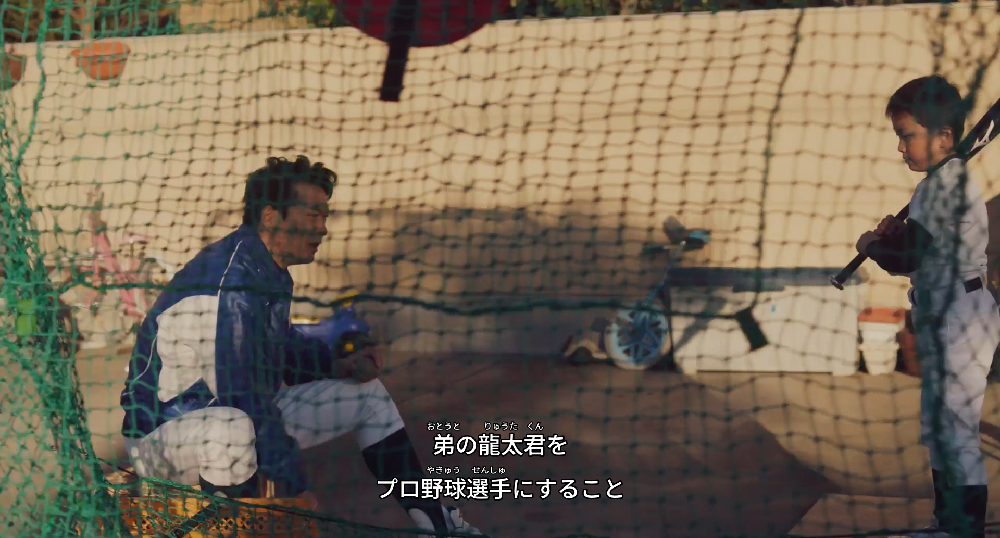
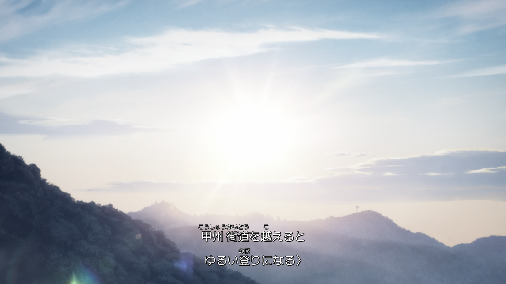
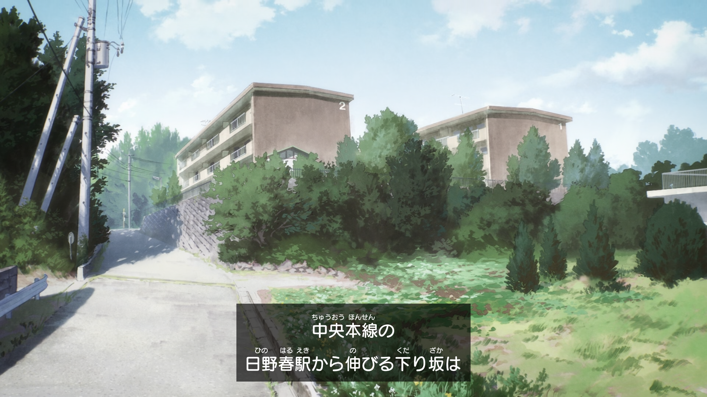
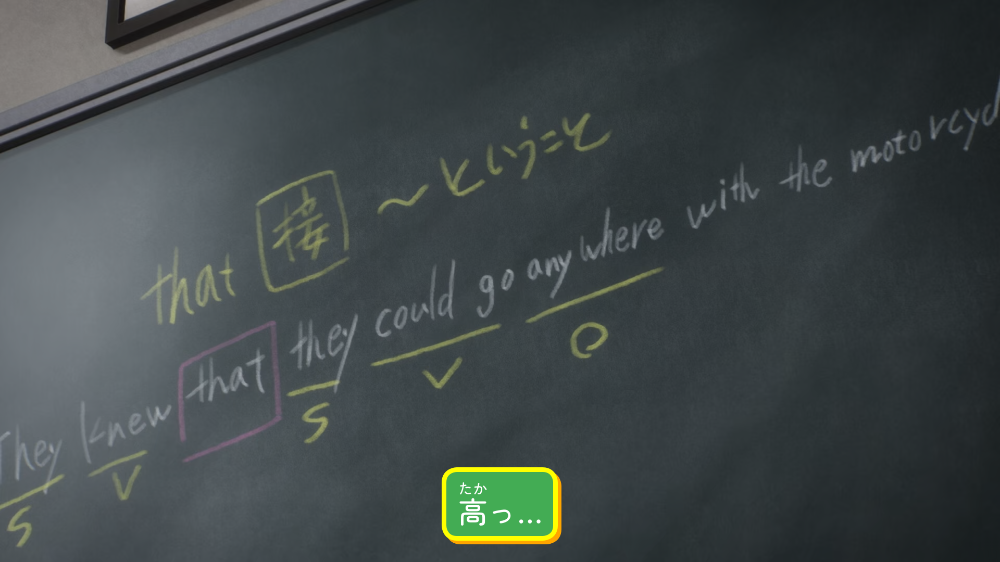
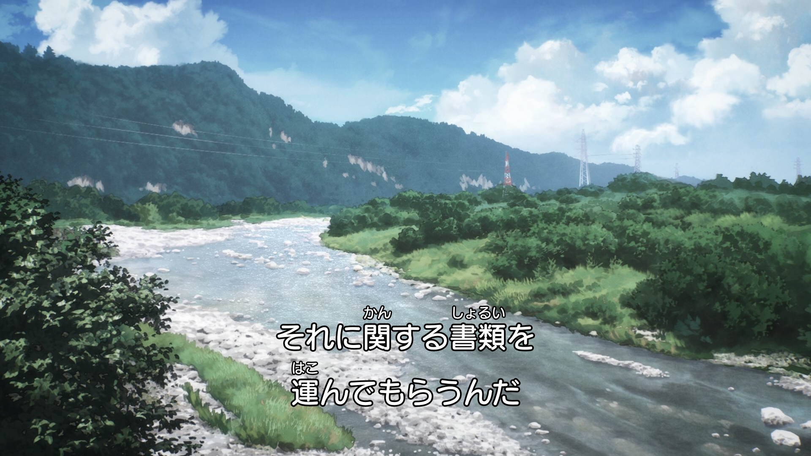
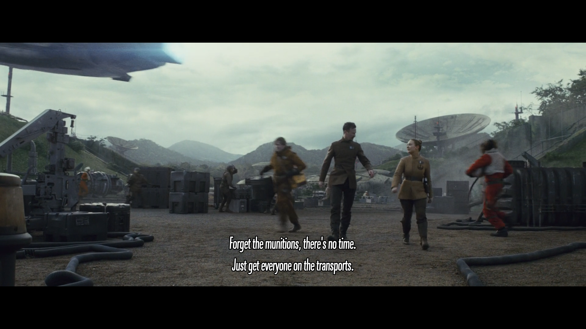
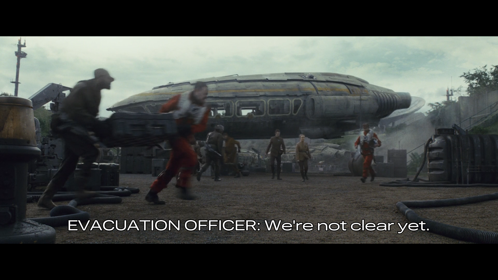
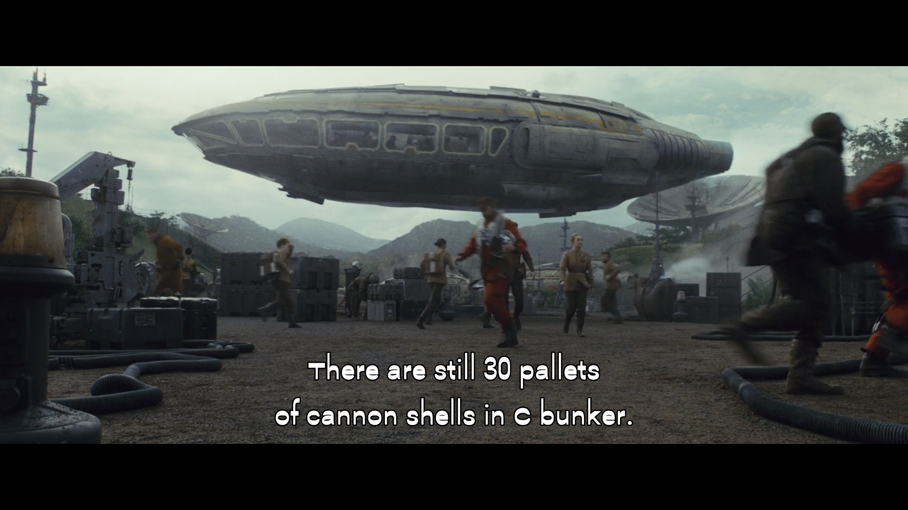

# ASS Furiganizer

A CLI utility to easily generate beautiful Japanese subtitles with furigana.

## Who can use it

- Japanese learners
- Video creators - you can fix any mistakes in the automatically generated furigana (see [blueprint](#generate-blueprint)) then hardcode the subtitles into the video with a video editor of your choice.

## Table of Contents

- [Installation](#installation)
- [Basic Usage](#basic-usage)
- [Configuration file](#configuration-file)
- [Configuration options](#configuration-options)
	+ [`positioning`](#positioning)
		* [`position`](#position)
		* [`align`](#align)
		* [`furigana_offset`](#furigana_offset)
		* [`line_distance`](#line_distance)
		* [`margin`](#margin)
		* [`shift`](#shift)
	+ [`styles.text`, `styles.furigana`](#stylestext-stylesfurigana)
		* [`fontsize`](#fontsize)
		* [`bold`](#bold)
		* [`italic`](#italic)
		* [`outline`](#outline)
		* [`shadow`](#shadow)
		* [`color`](#color)
		* [`outline_color`](#outline_color)
		* [`shadow_color`](#shadow_color)
	+ [`styles.furigana`](#stylesfurigana)
		* [`scale_factor`](#scale_factor)
	+ [`styles.opaque_box`](#stylesopaque_box)
		* [`enable`](#enable)
		* [`padding`](#padding)
		* [`outline`](#outline-1)
		* [`shadow`](#shadow-1)
		* [`border_radius`](#border_radius)
		* [`color`](#color-1)
		* [`outline_color`](#outline_color-1)
		* [`shadow_color`](#shadow_color-1)
	+ [`styles.blur`](#stylesblur)
		* [`text`, `furigana`, `opaque_box`](#text-furigana-opaque_box)
	+ [`styles.shadow_direction`](#stylesshadow_direction)
		* [`text`, `furigana`, `opaque_box`](#text-furigana-opaque_box-1)
	+ [`styles`](#styles)
		* [`font_path`](#font_path)
		* [`consistent_font_size`](#consistent_font_size)
	+ [`miscellaneous`](#miscellaneous)
		* [`output_dir`](#output_dir)
		* [`analyzer`](#analyzer)
		* [`add_suffix`](#add_suffix)
		* [`suffix`](#suffix)
		* [`interactive`](#interactive)
	+ [`substitute`](#substitute)
		* [`text`](#text)
		* [`furigana`](#furigana)
- [Configuration types](#configuration-types)
	+ [`Color`](#color-2)
	+ [`AxesArray`](#axesarray)
	+ [`Font`](#font)
- [Command Line options](#command-line-options)
	+ [`--config-name`](#config-name)
	+ [`--font-path`](#font-path)
	+ [`--shift-time`](#shift-time)
	+ [`--generate-blueprint`](#generate-blueprint)
	+ [`--ignore-output-dir`](#ignore-output-dir)
	+ [`--print-all-chars`](#print-all-chars)
	+ [`--no-embed-font`](#no-embed-font)
	+ [`--resolution`](#resolution)
- [How does it work](#how-does-it-work)
- [Examples](#examples)


## Installation

Install globally:

```shell
npm i -g ass-furiganizer
```

Run:

```shell
furiganize --help
```

## Basic Usage

This program requires at least a subtitles file and a video file. Suppose you have both in the current directory:

```shell
furiganize -i sub.srt -v video.mkv
```

This will create a `video.ass` file next to the `video.mkv` file.

It can be used in bulk. Suppose you have `subs` and `videos` folders in the current directory containing equal amount of subtitle and video files respectively:

```shell
furiganize -i subs/*.srt -v videos/*.mp4
```

## Configuration file

During installation a configuration file is created in your data directory. `furiganizer-config` command is used for managing the config directory:

```shell
furiganizer-config --help
```

To see where the config directory is located run:

```shell
furiganizer-config --path
```

To generate a new configuration file:

```shell
furiganizer-config --generate
```

## Configuration options

### `positioning`

#### `position`

Type: `number`

Description: text position on the screen in Numpad style, e.g., 2 - bottom, 8 - top:

```
┌───────────────┐
│ 7     8     9 │
│ 4     5     6 │
│ 1     2     3 │
└───────────────┘
```

#### `align`

Type: `'start' | 'center' | 'end' | 'auto'`

Description: text alignment. `'auto'` aligns text based on the `position` towards the closest border (`'start'` for 1,4,7; `'end'` for 3,6,9), otherwise centered.

#### `furigana_offset`

Type: `number`

Description: distance between text and furigana in px.

#### `line_distance`

Type: `number`

Description: distance between lines in px.

#### `margin`

Type: `number`

Description: offset from the border in px.

#### `shift`

Type: `[number, number]`

Description: optionally move the subtitles by the `[x, y]` axes in px (see [`AxesArray`](#axesarray)). 

### `styles.text`, `styles.furigana`

#### `fontsize`

Type: `number`

Description: text size (height) in px. 

#### `bold`

Type: `boolean`

Description: make text bolder.

#### `italic`

Type: `boolean`

Description: make text italic.

#### `outline`

Type: `number`

Description: text border size in px.

#### `shadow`

Type: `number`

Description: distance of the shadow from the text in px.

#### `color`

Type: string

Description: color of the text. See [`Color`](#color).

#### `outline_color`

Type: string

Description: color of the text border. See [`Color`](#color).

#### `shadow_color`

Type: string

Description: color of the text shadow. See [`Color`](#color).

### `styles.furigana`

#### `scale_factor`

Type: number

Description: if this is specified, everything in the `styles.furigana` block will be ignored and the text styles used for furigana. `furigana.fontsize = text.fontsize * scale_factor`. This should be a positive decimal number. If this is commented with a `#`, the furigana styles are provided separately.

### `styles.opaque_box`

#### `enable`

Type: `boolean`

Description: display text background. For now this can't be used with subtitles that have overlaps (a subtitle starts before the last one ends).

#### `padding`

Type: `number` | `[number, number]`

Description: background padding in px. Can be a number or an array for separate horizontal and vertical padding (see [`AxesArray`](#axesarray)).

#### `outline`

Type: number

Description: background outline in px.

#### `shadow`

Type: number

Description: distance of the shadow from the background in px.

#### `border_radius`

Type: number

Description: make the corners of the box rounded. Radius in px.

#### `color`

Type: string

Description: color of the box. See [`Color`](#color).

#### `outline_color`

Type: string

Description: color of the box border. See [`Color`](#color).

#### `shadow_color`

Type: string

Description: color of the box shadow. See [`Color`](#color).

### `styles.blur`

#### `text`, `furigana`, `opaque_box`

Type: `number`

Description: blur the outline if it is nonzero, otherwise blur text or box.

### `styles.shadow_direction`

#### `text`, `furigana`, `opaque_box`

Type: `[number, number]`

Description: uncomment to override shadow direction. If `shadow = <n>`, it is the same as `shadow_direction = [<n>, <n>]`. These values unlike shadow can be negative. At least one of the values should be nonzero.

See [`AxesArray`](#axesarray).

### `styles`

#### `font_path`

Type: `string`

Description: see [`Font`](#font).

#### `consistent_font_size`

Type: `boolean`

Description: adjust font size for different video resolutions. This will make the proportion of the text size to the video height remain constant. This way if you open two videos of different resolutions in full screen the subtitles will look the same. All the values specified in px will remain as is for 1080p resolution and will be adjusted for other resolutions.

### `miscellaneous`

#### `output_dir`

Type: `string`

Description: directory to save generated subtitles to. The directory where your video player looks for subtitles can be provided here.

#### `analyzer`

Type: `string`

Description: choose the morphological analyzer. Can be `kuromoji` or `mecab`. `kuromoji` does not require any configuration. If you want to use `mecab` you need to install it on your machine and make sure it's in the PATH.

#### `add_suffix`

Type: `boolean`

Description: add a language suffix to the name of the generated file (`<video_name>.<suffix>.ass`).

#### `suffix`

Type: `string`

Description: suffix to add.

#### `interactive`

Type: `boolean`

Description: you'll be prompted for options if a variable font or font collection is provided. If set to false the default variation or the first font from the collection will be used.

### `substitute`

#### `text`

Type: `[string, string][]`

Description: substitute one or more characters. May be useful when there are unimportant characters that are unsupported by the font. Takes an array consisting of arrays that have two strings: [`<match>`, `<substitute>`]. `<substitute>` should be an empty string to remove the `<match>` character(s). `<match>` can be a Unicode string representing one character: `U+0049`, `U+1F610`.

#### `furigana`

Type: `[string, string][]`

Description: may be useful for furigana if you, for example, need a specific katakana phrase as the analyzer will turn everything to hiragana. Works the same as for `text` but will only match the full phrase.

## Configuration types

### Color

Color is a string that can be:
- a [`named`](https://www.w3.org/TR/SVG11/types.html#ColorKeywords) color value: 'white', 'black', 'yellow'
- a HEX color: '#ffffff', '#ffffff80'
- an RGB color: 'rgb(255,255,255)', 'rgba(255,255,255,0.5)'
- a native `SubStation Alpha` color.

### AxesArray

An array consisting of two numbers for the X and Y axes: `[x, y]`.

### Font

An absolute or relative path to the font file. Accepted extensions: `ttf`, `otf` and `ttc`. Variable fonts are supported.

The priority is: `--font-path` in CMD -> `font_path` in the config -> fallback font (Noto Sans JP Medium).

## Command Line options

### --config-name

If you want to use multiple configs, create a copy of `config.toml`, give it a name (`<config_name>.toml`). Use `--config-name` or `-c` to specify the name without the extension:

```shell
furiganize -i *.srt -v *.mkv -c <config_name>
```

By default, `config.toml` is used.

### --font-path

```shell
furiganize -i *.srt -v *.mkv -f MyFont.ttf
```

See [`Font`](#font)

### --shift-time

Specify the time in seconds to shift the subtitles:

```shell
furiganize -i *.srt -v *.mkv -s 0.9
```

### --generate-blueprint

If you want to fix any mistakes in the furigana and make the subtitles production ready:

```shell
furiganize -i subs.srt -v video.mkv -B
```

This will create a `subs.bp` file. It contains all the dialogues, each of them has the following structure:

- A line containing the dialogue counter and the timings
- One or more arrays, each representing a single line of that dialogue. Each of the arrays contains one or more objects with a `text` and `furigana` fields

After editing the file generate new subtitles one more time providing the `.bp` file instead of `.srt`:

```shell
furiganize -i subs.bp -v video.mkv
```

### --ignore-output-dir

By default the generated subtitles are saved next to the video. If `output_dir` in the config is set but the default behavior is needed once, add the `-O` flag.

### --print-all-chars

Use `-U` to dump all the unsupported characters to the console.

### --no-embed-font

If there is a problem with creating font subset or you have it installed and don't want to embed it into the file you can skip it:

```shell
furiganize -i *.srt -v *.mkv --no-embed-font
```

It can't be skipped for a variable font.

### --resolution

If the resolution can't be detected automatically from the video, this resolution will be used. Should be a string like `1920x1080`.

## How does it work

`SubStation Alpha` format does not have a proper support for furigana, so this library separates text into separate chunks and places them using positioning capability of this format calculating the correct position for each of them.

These calculations rely on the metrics of the font that is used, so to ensure the subtitles are displayed correctly, a subset of the font is created only containing a set of the necessary characters and embedded into the generated script.

It's also necessary to know the resolution of the video for correct positioning so a video file is required.

These subtitles are not guaranteed to work in every video player. It's recommended to use MPV or a recent version of VLC. Hardcoding (burning) them into a video might be a good option for public use. 

## Examples












This library can also work with non-Japanese languages.

To demonstrate how variable fonts work, here are three examples of the same [font](https://v-fonts.com/fonts/roboto-flex) that has lots of adjustable variable axes such as `Weight`, `Width`, `Slant`, etc.:





